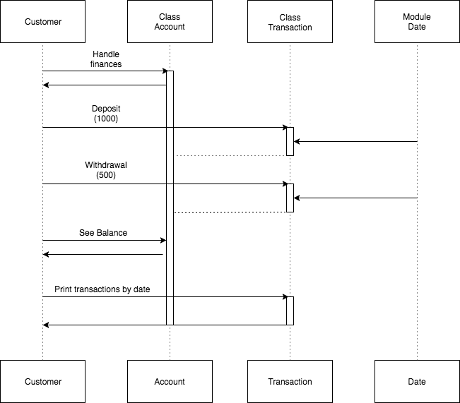

# Bank tech test example

## Specification

### Requirements

You should be able to interact with the your code via a REPL like IRB or the JavaScript console. (You don't need to implement a command line interface that takes input from STDIN.)
Deposits, withdrawal.
Account statement (date, amount, balance) printing.
Data can be kept in memory (it doesn't need to be stored to a database or anything).
Acceptance criteria

Given a client makes a deposit of 1000 on 10-01-2012 And a deposit of 2000 on 13-01-2012 And a withdrawal of 500 on 14-01-2012 When she prints her bank statement Then she would see

```
date || credit || debit || balance
14/01/2012 || || 500.00 || 2500.00
13/01/2012 || 2000.00 || || 3000.00
10/01/2012 || 1000.00 || || 1000.00
```

### User stories
```
As a customer,
So I can manage my finances,
I'd like to make a deposit to my bank account.

As a customer,
So I can manage my finances,
I'd like to make a withdrawal from my account.

As a customer,
So I can check how much money I have in my account,
I'd like to see my balance.

As a customer,
So I have proof of my transactions,
I'd like to print these listed by latest date.
```

### Sequence diagram



https://www.draw.io/#G0B76mugBDdRAvcnpUUnllOGM5bVU
